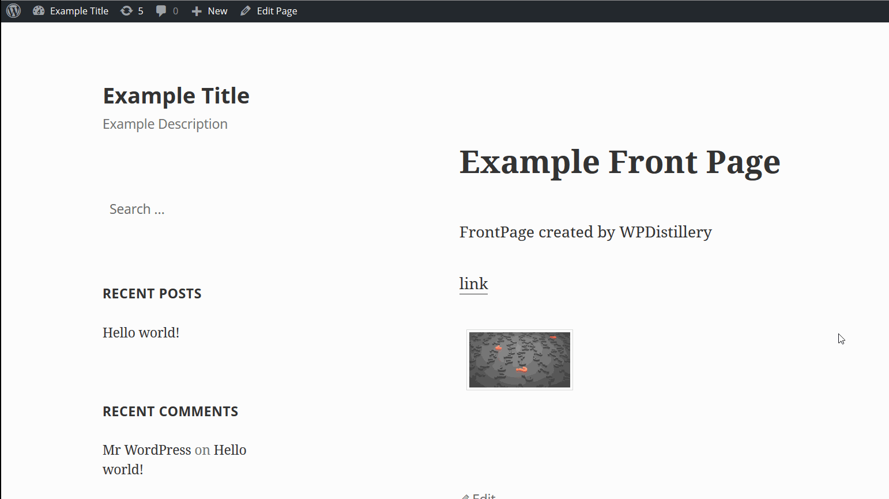
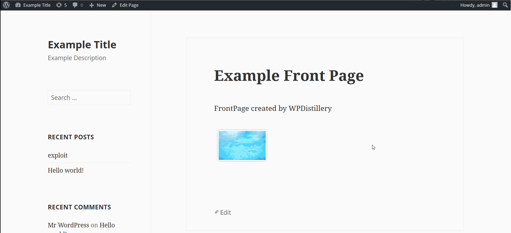
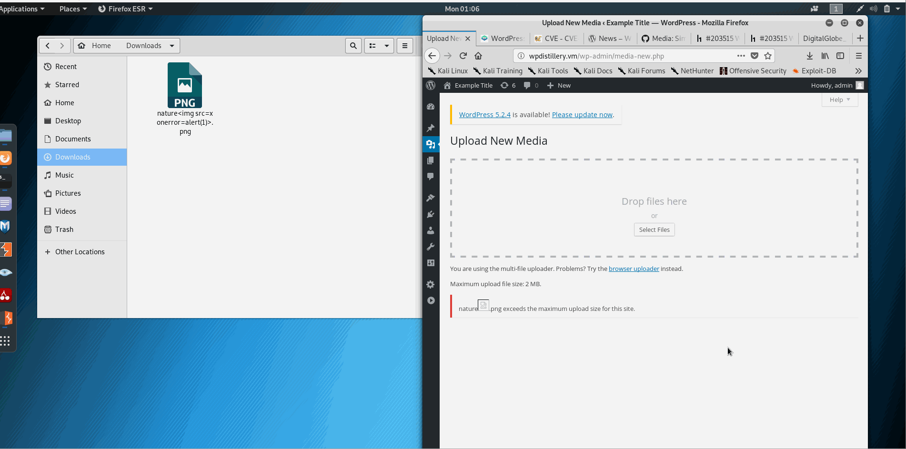
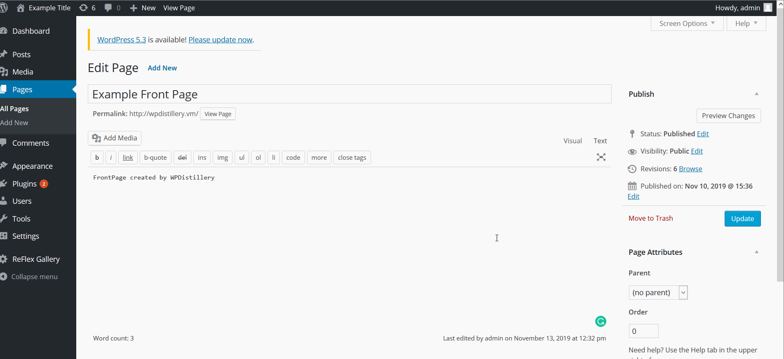

# Project 7 - WordPress Pentesting

Time spent: **5** hours spent in total

> Objective: Find, analyze, recreate, and document **three vulnerabilities** affecting an old version of WordPress

## Pentesting Report

1. (Required) Authenticated Stored Cross-Site Scripting
  - [ ] Summary: Cross-site scripting (XSS) vulnerability in WordPress before 4.2.3 allows remote authenticated users to inject arbitrary web script or HTML by leveraging the Author or Contributor role to place a crafted shortcode inside an HTML element, related to wp-includes/kses.php and wp-includes/shortcodes.php.
    - Vulnerability types: XSS
    - Tested in version: 4.2
    - Fixed in version: 4.2.3
  - [ ] GIF Walkthrough:
  
  - [ ] Steps to recreate: 
  To recreate this exploit, I placed the following script in the HTML edit post box:
  ```
  <a href="[caption code=">]</a><a title=" onmouseover=alert('test')  ">link</a>
  ```
which resulted in the execution of a script without any click or otherwise.
  - [ ] Affected source code:
    - [Link](https://klikki.fi/adv/wordpress3.html)
    
2. (Required) Authenticated Stored Cross-Site Scripting via Image Filename
  - [ ] Summary: Cross-site scripting (XSS) vulnerability in the media_handle_upload function in wp-admin/includes/media.php in WordPress before 4.6.1 might allow remote attackers to inject arbitrary web script or HTML by tricking an administrator into uploading an image file that has a crafted filename.
    - Vulnerability types: XSS
    - Tested in version: 4.2
    - Fixed in version: 4.6.1
  - [ ] GIF Walkthrough:
  
  - [ ] Steps to recreate:
  When an image with a file name such as:
  ```exploit.jpg``` 
  is uploaded and viewed within WordPress the script code is executed when the user goes to the page.
  The solution would be to sanitize the file name during the upload process.
  - [ ] Affected source code:
    - [Link](https://github.com/WordPress/WordPress/commit/c9e60dab176635d4bfaaf431c0ea891e4726d6e0)
    
3. (Required) Large File Upload Error XSS
  - [ ] Summary: In WordPress before 4.7.5, a cross-site scripting (XSS) vulnerability exists when attempting to upload very large files, because the error message does not properly restrict presentation of the filename. 
    - Vulnerability types: XSS
    - Tested in version: 4.2
    - Fixed in version: 4.7.5
  - [ ] GIF Walkthrough:
  
  - [ ] Steps to recreate:
  I created a large image file and uploaded the manipulated name to pass a script:

  In this page:
  ```http://wpdistillery.vm/wp-admin/media-new.php```
  uploaded image with name:
  ```nature.png```
  - [ ] Affected source code:
    - [Link](https://github.com/WordPress/WordPress/commit/8c7ea71edbbffca5d9766b7bea7c7f3722ffafa6)
    
4. (Optional) Authenticated Stored Cross-Site Scripting (XSS) in YouTube URL Embeds
  - [ ] Summary: In WordPress before 4.7.3 (wp-includes/embed.php), there is authenticated Cross-Site Scripting (XSS) in YouTube URL Embeds.
    - Vulnerability types: XSS
    - Tested in version: 4.2
    - Fixed in version: 4.7.3
  - [ ] GIF Walkthrough:
  
  - [ ] Steps to recreate:
  I edited a YouTube URL to include a script like so:
  ```[embed src='https://youtube.com/embed/123\x3csvg onload=alert(123)\x3e'][/embed]```
  and put it inside the edit page box. When I press publish and navigate to the page, it will open the alert box.
  - [ ] Affected source code:
    - [Link](https://github.com/WordPress/WordPress/commit/419c8d97ce8df7d5004ee0b566bc5e095f0a6ca8)

## Resources

- [WordPress Source Browser](https://core.trac.wordpress.org/browser/)
- [WordPress Developer Reference](https://developer.wordpress.org/reference/)

GIFs created with [LiceCap](http://www.cockos.com/licecap/).

## License

    Copyright [2019] [Kartikeya Sharma]

    Licensed under the Apache License, Version 2.0 (the "License");
    you may not use this file except in compliance with the License.
    You may obtain a copy of the License at

        http://www.apache.org/licenses/LICENSE-2.0

    Unless required by applicable law or agreed to in writing, software
    distributed under the License is distributed on an "AS IS" BASIS,
    WITHOUT WARRANTIES OR CONDITIONS OF ANY KIND, either express or implied.
    See the License for the specific language governing permissions and
    limitations under the License.
